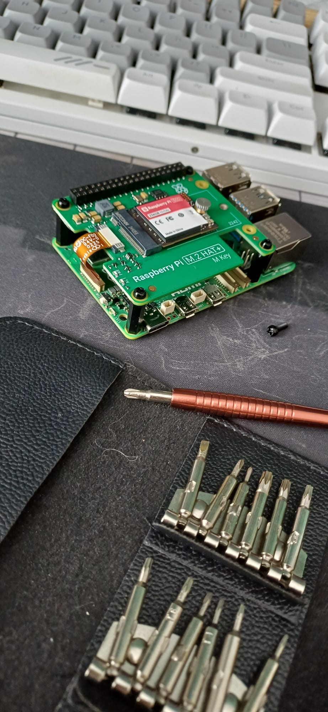

No dobra, trzeba gdzieś tego [homeassistant-operator](https://github.com/przemekhys/homeassistant-operator) uruchomić. Nie spodziewam się, by ktokolwiek zainteresował się tym projektem aż do momentu, gdy będzie w miarę stabilny i faktycznie udowodnione, że chociaż 1 instancja działa na nim dobrze - wniosek jest prosty: to musi być moja instancja.


## Jedna malina to za mało – buduję poligon doświadczalny

Mam obecnie już uruchomioną jedną instancję HA na Raspberry Pi 5, używam tam [Home Assistant Operating System](https://github.com/home-assistant/operating-system) z [Supervisor](https://github.com/home-assistant/supervisor) uruchomionym jako kontener. Jak o tym myślę, to o ile łatwiej byłoby użyć Supervisor w k8s, gdyby nie skupiał się tak bardzo na utrzymaniu wszystkiego w jednym gotowym systemie - trzeba się z tym pogodzić, bo to podejście zaspokaja potrzeby 99% użytkowników HA, a ten 1% i tak sobie poradzi, czy to uruchamiając HA na systemie jako usługę, czy niezależny kontener gdzieś w swoim orkiestratorze. Więc mam już jedną malinkę pod swoją opieką, ale już dziś jest "produkcyjna" - włącza mi światła na podwórzu przed zmierzchem, wysyła powiadomienia, gdy dzieci nie zamkną lodówki, powiadomi, że zmywarka skończyła pracę i mogę już drugi wsad wsadzić, czy jest infrastruktura do zbierania danych z czujników rozsianych po domu - chcę, by to działało jak najdłużej. Więc naturalnym pomysłem jest dostawienie sobie drugiego środowiska, gdzie będę uruchamiał moje eksperymentalne podejście z operatorem, a gdy uznam, że jest wystarczająco dobre, przeniosę się z moim "biznesem" na nowe "lepsze" instancje HA. Zakupiłem więc drugą malinę, identyczną - mam zestaw z dyskiem SSD, bo intensywne zapisywanie danych na karcie SD zazwyczaj ją zabija, a ja chcę agregować sporo danych o moim domu. Nie wspomnę już, że przy użyciu etcd dla k3s to właściwie wyrok śmierci dla takiej karty SD, a jak karta SD nie żyje, to całość przestaje działać i jest to moment, gdy musisz się dowiedzieć, czy twoje backupy faktycznie działają. Szybkie zakupy, mam część rzeczy jeszcze z zeszłego roku, więc nie wszystko jest potrzebne, i będę się cieszył nową zabawką.




## Kiedy rzeczywistość mówi: poczekaj jeszcze kilka dni

Odebrałem od kuriera paczkę, już już jaram się jak dziecko. Od kilku dni planuję sobie, co zainstaluję, jak to skonfiguruję, plany mam na rok do przodu! Malina pachnie nowością, wszystko ładnie zafoliowane, nie miałem czasu się tym zająć w spokoju, to paczkę odłożyłem na potem. W weekend, gdy okazało się, że będę miał 30 minut, w których nikt mi nie będzie przeszkadzał, zabrałem się za składanie - kilka śrub, podłączyć odpowiednio GPIO, żeby nie wygiąć pinów, zawsze się tego boję, i gotowe. Karta SD wsadzona, mam na niej pewnie jeszcze sprzed roku OS, więc powinno iść gładko. Wsadam dysk SSD, mam dedykowane rozszerzenie, w takich momentach czuję, że życie jest piękne. Podłączam klawiaturę i myszkę - zrobimy to po staremu, chcę zobaczyć ten koślawy desktop XFCE. Zaraz, zaraz, a gdzie przejściówka do HDMI? Płytka ma micro HDMI, a ja tylko HDMI, miałem gdzieś tę przejściówkę na pewno.


Nie ma, przejściówka zniknęła, widziałem ją ze 2 tygodnie temu, teraz nie ma. Szybka kalkulacja - czy chce mi się zgadywać, czy na karcie SD był OS z włączonym SSH? Miał on sieć skonfigurowaną? Łączył się do WiFi czy był eth0 włączony? Wkurzony kupuję przejściówkę, okno możliwości przesuwa się, paczka przyjdzie za kilka dni, pewnie w weekend znowu będę miał czas, żeby sobie usiąść i podłubać... ech... pójdę na spacer...


## PoE? Bardziej Po-Error

Przyszła kolejna paczka, jest w środku mały kabelek, który da mi tyle radości. Od razu sprawdzam, czy pasuje, mam przeświadczenie, że to miało być mini, a nie micro, uff... pasuje jednak micro... czyli mam wszystko! Teraz potrzeba czasu i będę mógł się tym zająć. Po paru dniach nastała chwila, że mogłem się zająć. Wyciągnąłem z szafy wszystkie rzeczy, dodatkowo kable do ethernetowe, połączyłem mój switch z gniazdkiem w pokoju, będę od razu sobie działał po miedzi, WiFi 6 jest spoko, ale kabel to kabel. Przełączam peryferia, podłączam zasilanie i czekam... pojawia się czarny ekran, bootuje się. Po chwili jest XFCE, to jest jakaś dystrybucja z Debianem, niech będzie, i tak potrzebuję tylko do zainstalowania systemu na dysku SSD, teraz bootowałem się z karty SD, ale mam już podłączony SSD i mogę spokojnie zapisać na dysk nowy system. Fajne narzędzie ```Raspberry Pi Imager``` załatwi sprawę, kiedyś używałem non stop ```dd```, ale jestem już stary i nie chce mi się bawić, klik klik i się zapisuje na dysk. Gotowe, wyłączam system, wyciągam kartę SD i włączam ponownie. Bootuje się, super, idzie jak po maśle. Została tylko ostatnia rzecz - PoE. Nie lubię kablozwy w mojej szafce rackowej, dorobiłem się takiej niezaduży w kotłowni i chcę mieć tam porządek, zwłaszcza że to chyba tylko 6 albo 7U, więc miejsca nie za dużo. Malinę, którą mam dłużej, tak właśnie zasilam - jeden kabel, nie trzeba zasilaczy, które są niewymiarowe i nie pasują do listwy, mniej bajzlu, sama rozkosz. Loguję się do panelu switcha, włączam na porcie PoE, to teraz ```shutdown -p now```, wyciągam wtyczkę zasilacza, wkładam kabel ethernet i... nic... nic nie mruga, nic się nie dzieje. Co jest? Patrzę na kabel, no pogięty, może jakaś para się zerwała i dupa? Mam jeszcze jeden kabel prosto z fabryki kabli, wtyczka zalana, no nic nie może się urwać, pięknie przechowywany, co najwyżej 45 stopni zakrzywienia, cat 6 będzie działać. Wymieniłem, ale nic nie dało... co jest... może trzeba jakoś to włączyć w raspberry, tylko jak? Sprawdzam dokumentację, ani słowa o włączeniu PoE, właściwie to ani słowa o PoE, dziwne, przecież już PoE używam. Sprawdzam dalej, wszyscy w internecie twierdzą, że trzeba mieć rozszerzenie do płytki, by to działało, ale ja już mam rozszerzenie z SSD, jak to do licha działa na starej malinie? Otwieram szafkę rackową i patrzę... zupełnie inne rozszerzenie, to najwyraźniej wspiera i SSD, i PoE, a moje tylko SSD. Ech... dokupię, nie znoszę zbędnych zasilaczy, z zabawą też się wstrzymam, niech hardware będzie działał w 100%, zanim go zamknę w szafce. Idę na spacer się przewietrzyć.

