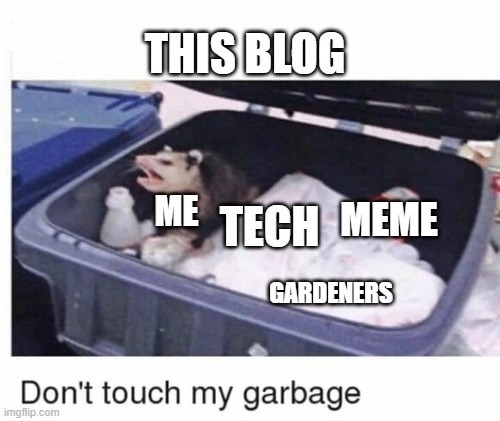

Witaj świecie po raz trzeci. Trzeci raz już zakładam bloga, trzeci raz mówię sobie, że będę tu regularnie pisał, trzeci raz konfigurowałem wszystkie potrzebne rzeczy, by móc napisać te słowa. Tym razem musi się udać. 

### Uda sie
A to trzy powody, dla których ostatnio mi się nie udało:

- kupiłem domenę na trzy lata
- wybierałem CMS 2 tygodnie
- pierwszy post był długim elaboratem na temat stosu TCP/IP i tym, jak skonfigurować kernel Linuxa optymalnie i wyższości nftables nad iptables

To trzy powody, dla których tym razem się uda:

- kupiłem domenę na rok
- piszę to w markdown
- pierwszy post jest krótkim żartobliwym wpisem o tym, dlaczego się uda

Zmieniłem filozofię działania, nie od razu rzucam się na głęboką wodę, małe kroczki, mały progress każdego dnia jest o wiele ważniejszy niż wielkie plany, wielki wysiłek, wielki progres.

### Co ja tu będę właściwe robił ?

O czym będę tu pisał? Na razie jeszcze nie do końca wiem, mam w planach zrobić kilka ciekawych rzeczy:

- będę sadził krzaki owocowe w ogrodzie
- będę używał home-assistant na Kubernetesie
- będę sadził jabłonie
- będę wklejał stanowczo za dużo obrazków i memów

Więc pewnie będzie sporo o ogrodnictwie, coś tam też napiszę o geekowych sprawach.

